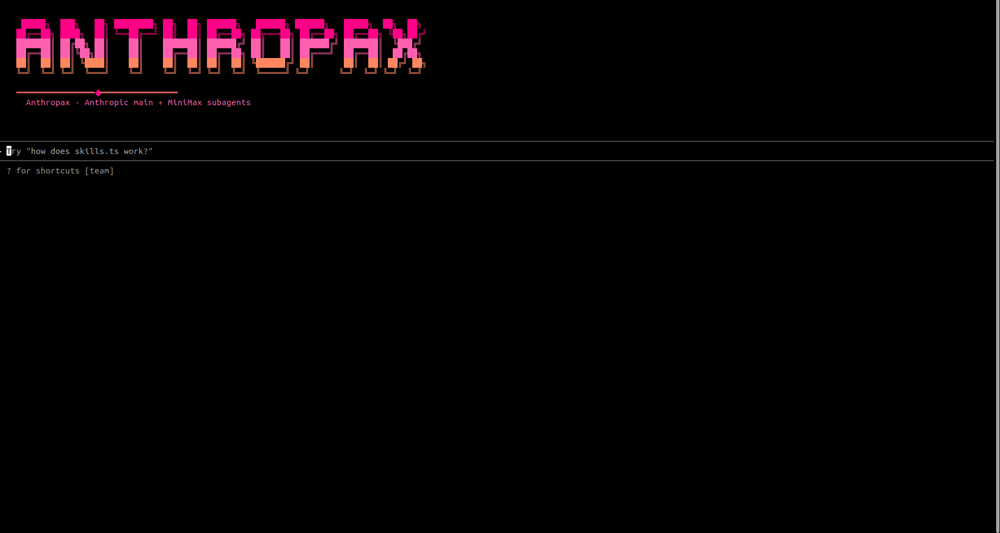

# CC-MIRROR

<p align="center">
  
</p>

<p align="center">
  <a href="https://www.npmjs.com/package/cc-mirror"></a>
  <a href="https://opensource.org/licenses/MIT"></a>
  <a href="https://twitter.com/nummanali"></a>
</p>

<p align="center">
  <strong>Create multiple isolated Claude Code variants with custom providers.</strong>
</p>

---

## What is CC-MIRROR?

```
┌────────────────────────────────────────────────────────────────────────────────┐
│                                                                                │
│   One tool. Multiple Claude Code instances. Complete isolation.                │
│                                                                                │
│   ┌──────────┐   ┌──────────┐   ┌──────────┐   ┌──────────┐   ┌──────────┐   │
│   │   zai    │   │ minimax  │   │openrouter│   │ ccrouter │   │ mclaude  │   │
│   │  GLM-4.7 │   │  M2.1    │   │ 100+ LLMs│   │  Local   │   │  Claude  │   │
│   └────┬─────┘   └────┬─────┘   └────┬─────┘   └────┬─────┘   └────┬─────┘   │
│        │              │              │              │              │          │
│        └──────────────┴──────────────┴──────────────┴──────────────┘          │
│                                      │                                         │
│                           ┌──────────▼──────────┐                             │
│                           │    Claude Code      │                             │
│                           │    (isolated)       │                             │
│                           └─────────────────────┘                             │
│                                                                                │
└────────────────────────────────────────────────────────────────────────────────┘
```

CC-MIRROR creates **isolated Claude Code instances** that connect to different AI providers. Each variant has its own config, sessions, themes, and API credentials — completely separate from each other.

---

## ⚡ Quick Start

```bash
# Run the interactive TUI
npx cc-mirror

# Or quick setup from CLI
npx cc-mirror quick --provider zai --api-key "$Z_AI_API_KEY"
```

<p align="center">
  
</p>

---

## 🔌 Supported Providers

| Provider             | Models                 | Auth       | Best For                               |
| -------------------- | ---------------------- | ---------- | -------------------------------------- |
| **Z.ai**             | GLM-4.7, GLM-4.5-Air   | API Key    | Heavy coding with GLM reasoning        |
| **MiniMax**          | MiniMax-M2.1           | API Key    | Unified model experience               |
| **Anthropax** ⭐ | Claude + MiniMax (dual) | OAuth + Key | Best of both: premium Claude + cost-effective subagents |
| **OpenRouter**       | 100+ models            | Auth Token | Model flexibility, pay-per-use         |
| **CCRouter**         | Ollama, DeepSeek, etc. | Optional   | Local-first development                |
| **Mirror**           | Claude (native)        | OAuth/Key  | Pure Claude with team mode             |

```bash
# Z.ai (GLM Coding Plan)
npx cc-mirror quick --provider zai --api-key "$Z_AI_API_KEY"

# MiniMax (MiniMax-M2.1)
npx cc-mirror quick --provider minimax --api-key "$MINIMAX_API_KEY"

# Anthropax ⭐ (Claude main + MiniMax subagents with local gateway)
npx cc-mirror quick --provider anthropic-router --name my-router --api-key "$MINIMAX_API_KEY"

# OpenRouter (100+ models)
npx cc-mirror quick --provider openrouter --api-key "$OPENROUTER_API_KEY" \
  --model-sonnet "anthropic/claude-3.5-sonnet"

# Claude Code Router (local LLMs)
npx cc-mirror quick --provider ccrouter

# Mirror Claude (pure Claude with team mode)
npx cc-mirror quick --provider mirror --name mclaude
```

---

## 📁 How It Works

Each variant lives in its own directory with complete isolation:

```
┌─────────────────────────────────────────────────────────────────────────┐
│  ~/.cc-mirror/                                                          │
│                                                                         │
│  ├── zai/                          ← Your Z.ai variant                  │
│  │   ├── npm/                      Claude Code installation             │
│  │   ├── config/                   API keys, sessions, MCP servers      │
│  │   ├── tweakcc/                  Theme & prompt customization         │
│  │   └── variant.json              Metadata                             │
│  │                                                                      │
│  ├── minimax/                      ← Your MiniMax variant               │
│  │   └── ...                                                            │
│  │                                                                      │
│  └── mclaude/                      ← Your Mirror Claude variant         │
│      └── ...                                                            │
│                                                                         │
│  Wrappers: ~/.local/bin/zai, ~/.local/bin/minimax, ~/.local/bin/mclaude │
│                                                                         │
└─────────────────────────────────────────────────────────────────────────┘
```

Run any variant directly from your terminal:

```bash
zai          # Launch Z.ai variant
minimax      # Launch MiniMax variant
mclaude      # Launch Mirror Claude variant
```

---

## ✨ Features

| Feature                    | Description                                                                            |
| -------------------------- | -------------------------------------------------------------------------------------- |
| **🔌 Multiple Providers**  | Z.ai, MiniMax, OpenRouter, CCRouter, Mirror, or custom endpoints                       |
| **📁 Complete Isolation**  | Each variant has its own config, sessions, and credentials                             |
| **🎨 Brand Themes**        | Custom color schemes per provider via [tweakcc](https://github.com/Piebald-AI/tweakcc) |
| **📝 Prompt Packs**        | Enhanced system prompts for Z.ai and MiniMax                                           |
| **🤖 Team Mode**           | Multi-agent collaboration with shared task management                                  |
| **🌉 LLM Gateway** ⭐       | Intelligent dual-model routing: Claude main + MiniMax subagents via localhost gateway  |
| **📋 Tasks CLI**           | Manage, archive, and visualize task dependencies from command line                     |
| **🔄 One-Command Updates** | Update all variants when Claude Code releases                                          |

---

## 🛠️ Commands

```bash
# Create & manage variants
npx cc-mirror create              # Full configuration wizard
npx cc-mirror quick [options]     # Fast setup with defaults
npx cc-mirror list                # List all variants
npx cc-mirror update [name]       # Update one or all variants
npx cc-mirror remove <name>       # Delete a variant
npx cc-mirror doctor              # Health check all variants

# Task management (team mode)
npx cc-mirror tasks               # List open tasks
npx cc-mirror tasks show <id>     # Show task details
npx cc-mirror tasks create        # Create new task
npx cc-mirror tasks update <id>   # Update task
npx cc-mirror tasks delete <id>   # Delete task
npx cc-mirror tasks archive <id>  # Archive task
npx cc-mirror tasks clean         # Bulk cleanup
npx cc-mirror tasks graph         # Visualize dependencies

# Launch your variant
zai                           # Run Z.ai variant
minimax                       # Run MiniMax variant
mclaude                       # Run Mirror Claude variant
```

---

## 🎛️ CLI Options

```
--provider <name>        zai | minimax | anthropic-router | openrouter | ccrouter | mirror | custom
--name <name>            Variant name (becomes the CLI command)
--api-key <key>          Provider API key
--base-url <url>         Custom API endpoint
--model-sonnet <name>    Map to sonnet model (OpenRouter)
--model-opus <name>      Map to opus model (OpenRouter)
--model-haiku <name>     Map to haiku model (OpenRouter)
--brand <preset>         Theme: auto | zai | minimax | openrouter | ccrouter | mirror
--enable-team-mode       Enable team mode (TaskCreate, TaskGet, TaskUpdate, TaskList)
--no-tweak               Skip tweakcc theme
--no-prompt-pack         Skip prompt pack
```

---

## 🎨 Brand Themes

Each provider includes a custom color theme:

| Brand          | Style                            |
| -------------- | -------------------------------- |
| **zai**        | Dark carbon with gold accents    |
| **minimax**    | Coral/red/orange spectrum        |
| **openrouter** | Teal/cyan gradient               |
| **ccrouter**   | Sky blue accents                 |
| **mirror**     | Silver/chrome with electric blue |

---

## 🤖 Team Mode

Enable multi-agent collaboration with shared task management:

```bash
# Enable on any variant
npx cc-mirror create --provider zai --name zai-team --enable-team-mode

# Mirror Claude has team mode by default
npx cc-mirror quick --provider mirror --name mclaude
```

Team mode enables: `TaskCreate`, `TaskGet`, `TaskUpdate`, `TaskList` tools plus an **orchestrator skill** that teaches Claude effective multi-agent coordination patterns.

### Tasks CLI (v1.4.0+)

Manage team tasks from the command line:

```bash
# List open tasks
npx cc-mirror tasks

# View across all teams
npx cc-mirror tasks --all

# Create and update tasks
npx cc-mirror tasks create --subject "Add auth" --description "JWT implementation"
npx cc-mirror tasks update 5 --status resolved --add-comment "Done"

# Cleanup resolved tasks
npx cc-mirror tasks clean --resolved --dry-run
npx cc-mirror tasks clean --resolved --force

# Archive instead of delete (preserves task history)
npx cc-mirror tasks archive 5

# Visualize dependency graph
npx cc-mirror tasks graph
```

### Project-Scoped Tasks (v1.2.0+)

Tasks are automatically scoped by project folder — no cross-project pollution:

```bash
# Run in different project folders - tasks stay isolated
cd ~/projects/api && mc      # Team: mc-api
cd ~/projects/frontend && mc # Team: mc-frontend

# Multiple teams in the same project
TEAM=backend mc   # Team: mc-myproject-backend
TEAM=frontend mc  # Team: mc-myproject-frontend
```

## 🪞 Anthropax (Dual-Model: Claude + MiniMax)

Route main Claude Code requests to **Anthropic** (via OAuth or subscription) while routing **subagents** to **MiniMax** via an intelligent local gateway. Get the best of both worlds: premium Claude models for your main work, cost-effective MiniMax for parallel agents.

```
┌─────────────────────────────────────────────────────────────────────────┐
│  Claude Code (main thread) ────────▶ Anthropic API (OAuth/subscription) │
│                                 ▲                                       │
│                                 │                                       │
│                           Subagent calls (model: minimax:*)             │
│                                 │                                       │
│                                 ▼                                       │
│                    ┌────────────────────────┐                           │
│                    │ LLM Gateway (localhost)│                           │
│                    │  Intelligent Routing   │                           │
│                    └────────────┬───────────┘                           │
│                                 │                                       │
│              ┌──────────────────┼──────────────────┐                    │
│              ▼                  ▼                  ▼                    │
│        MiniMax-M2.1      Anthropic API    Capability                    │
│        (Subagents)       (Fallback)        Fallback                     │
│                                   (Images/Docs/Files)                   │
└─────────────────────────────────────────────────────────────────────────┘
```

### How It Works

1. **Main requests** — Claude Code connects to `api.anthropic.com` directly (OAuth/subscription works natively)
2. **Subagent routing** — Requests with model prefix `minimax:<model>` automatically route to MiniMax
3. **Intelligent fallbacks** — Requests with images, documents, or file uploads automatically fallback to Anthropic (MiniMax limitation handling)
4. **Streaming support** — Server-sent events (SSE) work seamlessly for both upstreams

### Quick Setup

```bash
# Interactive setup wizard
npx cc-mirror create --provider anthropic-router --name my-router

# Or rapid setup
npx cc-mirror quick --provider anthropic-router --name my-router

# Launch your router
my-router
```

### Configuration Details

The router stores MiniMax credentials separately from Claude Code environment:

```bash
# Edit your variant's config
nano ~/.cc-mirror/my-router/config/settings.json
```

```json
{
  "env": {},
  "proxyEnv": {
    "MINIMAX_API_KEY": "your-minimax-api-key"
  }
}
```

- **`env`** — Variables available to Claude Code (public)
- **`proxyEnv`** — Variables read-only by the gateway (MiniMax key stays private, never exposed to Claude Code)

### Routing Behavior

| Request Type                         | Routes To                    | Why                                   |
| ------------------------------------ | ---------------------------- | ------------------------------------- |
| Main Claude Code interaction         | Anthropic                    | OAuth/subscription work seamlessly    |
| Subagent with `minimax:MiniMax-M2.1` | MiniMax                      | Explicit routing via model prefix     |
| Any request with images/documents    | Anthropic (auto-fallback)    | MiniMax doesn't support media         |
| Temperature outside `(0, 1]` range   | Anthropic (auto-fallback)    | MiniMax temperature constraint        |
| Any `file_id` in request             | Anthropic (auto-fallback)    | MiniMax lacks file handling           |

### Architecture

The LLM Gateway:

- **Runs as a localhost server** started automatically when you launch your variant
- **Uses a preload hook** to intercept Claude Code's fetch calls intelligently
- **Path-prefix security** with random per-launch prefixes prevents unauthorized access
- **Preserves all headers** and auth correctly for each upstream (Anthropic OAuth, MiniMax API key)
- **Supports streaming** with byte-for-byte SSE passthrough

### What This Enables

| Goal                         | How the Router Helps                                                      |
| ---------------------------- | --------------------------------------------------------------------------- |
| **Premium main work**        | Claude 3.5 Sonnet on Anthropic for your conversations                      |
| **Cost-effective agents**    | MiniMax-M2.1 for parallel subagent tasks (lower cost)                     |
| **Seamless OAuth**           | No API key needed for Anthropic — use your subscription                    |
| **Automatic capability handling** | Images/docs intelligently fallback, no manual routing needed        |
| **Best of both models**      | Leverage strengths: Claude's reasoning + MiniMax's availability           |

### Troubleshooting

| Issue                         | Solution                                          |
| ----------------------------- | ------------------------------------------------- |
| Gateway won't start           | Check port `7861` is available; restart variant |
| Subagents routing to Anthropic | Verify `CLAUDE_CODE_SUBAGENT_MODEL=minimax:MiniMax-M2.1` |
| MiniMax API key errors        | Confirm key in `proxyEnv`, not `env`             |
| Images not working with subagents | Expected — they auto-fallback to Anthropic    |

→ [Full LLM Gateway Technical Docs](docs/LLM-GATEWAY.md)

---

## 🪞 Mirror Claude

A pure Claude Code variant with enhanced features:

- **No proxy** — Connects directly to Anthropic's API
- **Team mode** — Enabled by default
- **Isolated config** — Experiment without affecting your main setup
- **Custom theme** — Silver/chrome aesthetic

```bash
npx cc-mirror quick --provider mirror --name mclaude
mclaude  # Authenticate via OAuth or API key
```

→ [Mirror Claude Documentation](docs/features/mirror-claude.md)

---

## 📚 Documentation

| Document                                        | Description                                          |
| ----------------------------------------------- | ---------------------------------------------------- |
| [Team Mode](docs/features/team-mode.md)         | Multi-agent collaboration with shared tasks          |
| [LLM Gateway ⭐](docs/LLM-GATEWAY.md)            | Dual-model routing: Claude main + MiniMax subagents |
| [Mirror Claude](docs/features/mirror-claude.md) | Pure Claude Code with enhanced features              |
| [Architecture](docs/architecture/overview.md)   | How cc-mirror works under the hood                   |
| [Full Documentation](docs/README.md)            | Complete documentation index                         |

---

## 🔗 Related Projects

- [tweakcc](https://github.com/Piebald-AI/tweakcc) — Theme and customize Claude Code
- [Claude Code Router](https://github.com/musistudio/claude-code-router) — Route Claude Code to any LLM
- [n-skills](https://github.com/numman-ali/n-skills) — Universal skills for AI agents

---

## 🤝 Contributing

Contributions welcome! See [CONTRIBUTING.md](CONTRIBUTING.md) for development setup.

**Want to add a provider?** Check the [Provider Guide](docs/TWEAKCC-GUIDE.md).

---

## 📄 License

MIT — see [LICENSE](LICENSE)

---

## Contributors

- [Numman Ali](https://github.com/numman-ali) — Creator — [@nummanali](https://twitter.com/nummanali)
- [Uzair Akrum](https://x.com/uzairakrum) — Contributor — [@uzairakrum](https://x.com/uzairakrum)

---

<p align="center">
  <strong>Created by <a href="https://github.com/numman-ali">Numman Ali</a></strong><br>
  <a href="https://twitter.com/nummanali">@nummanali</a>
</p>
